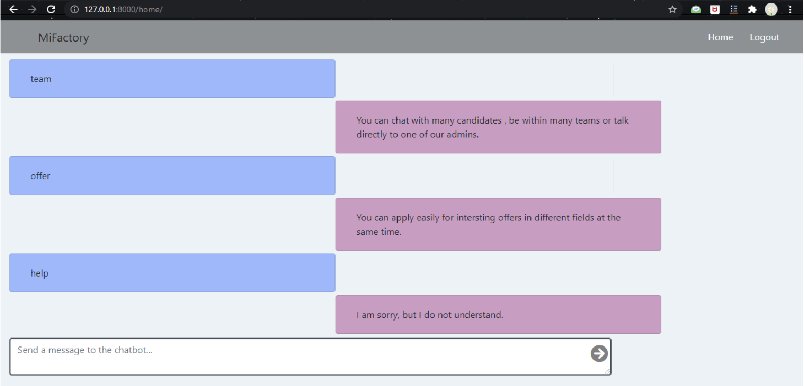

# recruitment-app-Django-CI-CD

-Architected & built a web application to get project owners in contact with candidates.
This app contains :
* 4 types of users : admin, modirator, candidate and project owner 
* A recommendation system using User-Based Collaborative Filtering : a technique used to predict the items that a user might like on the basis of ratings given to that item by other users who have similar taste with that of the target user.
* An AI chatbot (conversational robot) using Chatterbot: a machine-learning based conversational dialog engine build in Python which makes it possible to generate responses based on collections of known conversations. 
* A real time chat and notifications.
* Offers managment (activate/ deactivate offers, update offers, add new offer, show the most popular offers (based on django-hitcount)

# Tools:
- UML
- Python 3.9 (Pandas, NumPy, SciPy, Pillow, Requests,Chatterbot and others) 
- Django.
- Flake8 
- Github actions (build a ci cd workflow)
- PostgreSQL
- HTML/CSS/JS

# Steps:
## windows
- python -m venv venv
- venv\Scripts\activate
- pip install -r requirements.txt
*database : (the used SGBD is postgresql "Pgadmin4" . the details of the database "name, port, password .." are in the file settings) 
- python manage.py makemigrations main
- python manage.py migrate
add superuser : 
- python manage.py createsuperuser
- python manage.py runserver

# Screens :
#### the home page of the project owner :

#### Offers details :
#### the chatbot:

#### the recommandation system:
#### candidate page :
#### list of appliceant :
#### notifications :
#### Real time chat :

